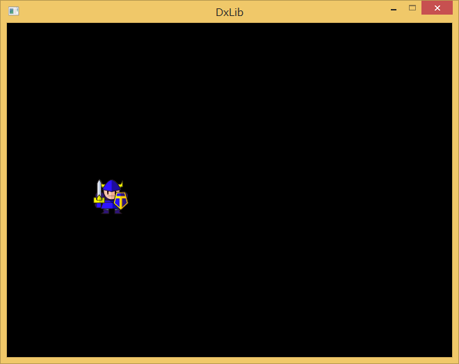

<script src="../cssjs/jquery-2.0.3.min.js"></script>
<script src="../cssjs/addimagename.js"></script>
<link rel="stylesheet" href="../cssjs/myrule.css"> 


#3-1　DXライブラリを使ってみよう
（リード）
DXライブラリはC言語でゲームを簡単に作れるようにするライブラリです。まずはDXライブラリを使ったプログラムを書くための準備を行い、簡単なテストプログラムを書いてみましょう。

##DXライブラリを使う準備をしよう
ゲームのプログラムを作るためには、Windowsが持つ3つの機能を使わなければいけません。1つめはキャラクターなどの絵を画面に描画する**グラフィックスの機能**。2つめはキーボードやマウス、ジョイパッドなどから**ユーザーの操作を受け取る機能**。3つめは効果音などを再生する**サウンド再生機能**です。この内、一番ややこしくて勉強が必要となるのは、1つめのグラフィックス機能です。

Windowsにはグラフィックスを担当する機能がいくつかあり、その中でゲームのために用意されているものが**DirectX【ダイレクトエックス】**です。DirectXはとても強力なのですが、使いこなすためにはWindowsプログラムや3Dグラフィックスのための数学について勉強しなければいけません。ここでDXライブラリを使うと、DirectXの難しい部分を隠し、わかりやすい関数を使ってゲームプログラムを書くことができます。


<div class="zuchuu">〈新しいプロジェクト〉をクリック</div>


##テストプログラムを書いてみよう
準備も終わったので、まずは最初のプログラムを書いてみましょう。追加済みのmain.cppに次のプログラムを入力してください。

<span class="hen">編：丸数字のところは図中文字で</span>

#####main.cpp　（コード1）
```
#include <DxLib.h>　❶DxLib.hのインクルード

int WINAPI WinMain(HINSTANCE h1, HINSTANCE hP, LPSTR lpC, int nC){　❷アプリケーションの開始
	//ウィンドウモードにする
	ChangeWindowMode(TRUE);	❸ウィンドウモード切替
	//DXライブラリ初期化
	if (DxLib_Init() == -1) return -1;	❹DXライブラリの初期化
	//ボックスを描画
	DrawBox(0, 0, 120, 120, 0x00FFFF, TRUE);	❺四角形の描画
	//待機
	WaitKey();	❻キー入力待ち
	//DXライブラリの終了処理
	DxLib_End();	❼DXライブラリの終了
	return 0;
}
```

ツールバーの〈ローカルWindowsデバッガー〉をクリックするか~~［F5］~~キーを押してプログラムを実行すると、次のような画面が表示されるはずです。コンソールアプリケーションでは「デバッグなしで実行」でしたが、ここからはウィンドウアプリケーションなのでデバッグつきで実行します。


| 新たに登場した関数 |
|--------|
| **SetDrawScreen【セットドロースクリーン】関数**<br>機能：描画の対象となる画面を指定する。定数DX_SCREEN_FRONTを指定した場合はオモテ画面（初期設定）、DX_SCREEN_BACKを指定した場合はウラ画面となる。<br>文法：`int SetDrawScreen( int DrawScreen )` |
| **ClearDrawScrenn【クリアドロースクリーン】**<br>機能：画面を消去する。<br>文法：int ClearDrawScreen(void)|
| **ScreenFlip【スクリーンフリップ】関数**<br>機能：オモテ画面とウラ画面を入れ替える。<br>文法：int ScreenFlip(void) |

##無限ループとProcessMessage関数
ゲームはクリアかゲームオーバーになるまで続くわけですから、for文よりもwhile文を使ったループのほうが適しています。次のソースコードは、while文を使って［Esc］キーが押されるまでの間、無限にループするようにしたものです。実行結果はfor文のときと同じですが、この後のゲームプログラムでも使う基本構造となります。

#####main.cpp　コード7
```
#include <DxLib.h>

int WINAPI WinMain(HINSTANCE h1, HINSTANCE hP, LPSTR lpC, int nC){
	//ウィンドウモードにする
	ChangeWindowMode(TRUE);
	//DXライブラリ初期化
	if (DxLib_Init() == -1) return -1;

	//画像を読み込み
	int ghandle = LoadGraph("media¥¥smp1_chara01.png");
	int x = 0;

	SetDrawScreen(DX_SCREEN_BACK);
	while (ProcessMessage() == 0 && CheckHitKey(KEY_INPUT_ESCAPE) == 0){
		ClearDrawScreen();
		if (x <= 320) x += 2;
		DrawGraph(x, 224, ghandle, TRUE);
		ScreenFlip();
	}

	//待機
	WaitKey();
	//DXライブラリの終了処理
	DxLib_End();
	return 0;
}
```




また、whileループの終了条件として、**CheckHitKey【チェックヒットキー】関数**によって~~［Esc］~~キーの状態を監視させています。この関数は指定したキーが押されていたら1を、押されていなければ0を返します。

監視するキーの種類は、右ページの表の**定数【ていすう】**によって指定します。

定数というのは変更できない変数のことです。**#define【シャープデファイン】プリプロセッサ**か、**const【コンスト】キーワード**を使って宣言します。constキーワードはC++の文法ですが、型チェックもできて便利です。

```t
#define PIE 3.1415926//コンパイル時にPIEという字は3.1415926に置換される
const float MAXENEMY = 10;//constキーワード付きの変数は内容を変更できない
```

|見出しなし|見出しなし|
|-------|-------|
	| KEY_INPUT_BACK | ~~［BackSpace］~~キー |
| KEY_INPUT_TAB | ~~［Tab］~~キー |
| KEY_INPUT_RETURN | ~~［Enter］~~キー |
|  |  |
| KEY_INPUT_LSHIFT | 左~~［Shift］~~キー |
| KEY_INPUT_RSHIFT | 右~~［Shift］~~キー |
| KEY_INPUT_LCONTROL | 左~~［Ctrl］~~キー |
| KEY_INPUT_RCONTROL | 右~~［Ctrl］~~キー  |
| KEY_INPUT_ESCAPE | ~~［Escape］~~キー |
| KEY_INPUT_SPACE | ~~［Space］~~キー |
| KEY_INPUT_PGUP | ~~［PageUp］~~キー |
| KEY_INPUT_PGDN | ~~［PageDown］~~キー |
| KEY_INPUT_END | ~~［End］~~キー |
| KEY_INPUT_HOME | ~~［Home］~~キー |
| KEY_INPUT_LEFT | ~~［←］~~キー |
| KEY_INPUT_UP | ~~［↑］~~キー |
| KEY_INPUT_RIGHT | ~~［→］~~キー |
| KEY_INPUT_DOWN | ~~［↓］~~キー |
| KEY_INPUT_INSERT | ~~［Ins］~~キー |
| KEY_INPUT_DELETE   | ~~［Del］~~キー |


#####コラム：ヌルポインタと文字列の扱い
CreateFontToHandle関数では、「フォント名かNULLのどちらか」を指定します。**NULL【ヌル】**というのは0を表す定数で、ポインタに代入するためのものです。メモリアドレスの0番地は使用しないことに決まっているので、NULLは**データがない**ことを意味します。

ところでなぜフォント名の文字列の代わりにNULLを指定できるのかというと、C言語では文字列をchar型配列変数（P.■■参照）の先頭位置を表すポインタとして扱うからです。ここにNULLを指定した場合、CreateFontToHandle関数は「フォントの指定は特にない」と判断し、デフォルトのフォントを使います。　

---


